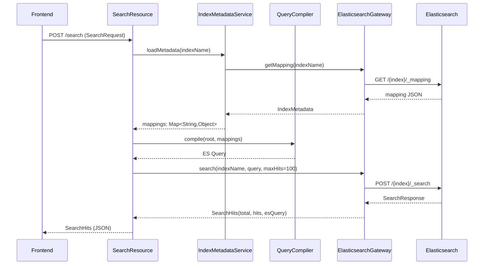
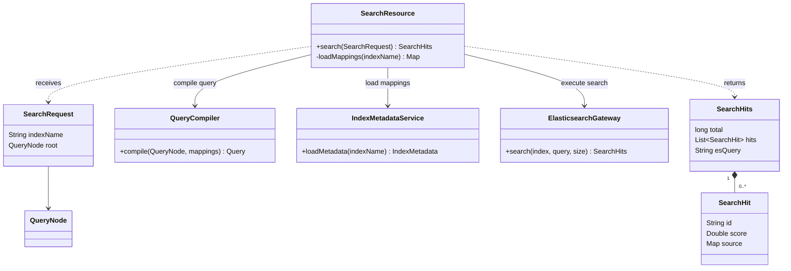
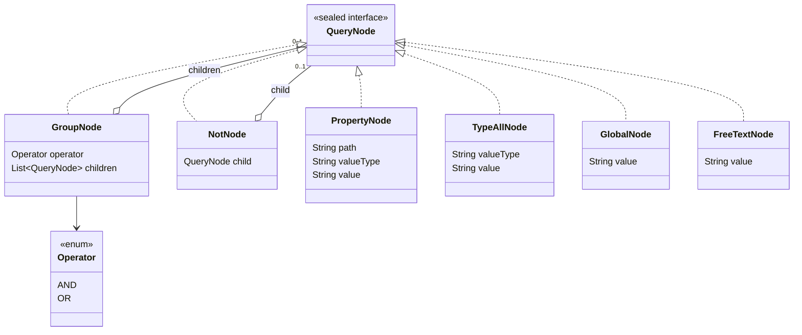

# Search Flow Overview

## Request / Response Flow

```mermaid
sequenceDiagram
    participant FE as Frontend
    participant SR as SearchResource
    participant IMS as IndexMetadataService
    participant QC as QueryCompiler
    participant ESG as ElasticsearchGateway
    participant ES as Elasticsearch

    FE->>SR: POST /search (SearchRequest)
    SR->>IMS: loadMetadata(indexName)
    IMS->>ESG: getMapping(indexName)
    ESG->>ES: GET /{index}/_mapping
    ES-->>ESG: mapping JSON
    ESG-->>IMS: IndexMetadata
    IMS-->>SR: mappings: Map<String,Object>
    SR->>QC: compile(root, mappings)
    QC-->>SR: ES Query
    SR->>ESG: search(indexName, query, maxHits=100)
    ESG->>ES: POST /{index}/_search
    ES-->>ESG: SearchResponse
    ESG-->>SR: SearchHits(total, hits, esQuery)
    SR-->>FE: SearchHits (JSON)
```

## Component Relations

```mermaid
classDiagram
    direction TB

    class SearchResource {
        +search(SearchRequest) SearchHits
        -loadMappings(indexName) Map
    }
    class SearchRequest {
        String indexName
        QueryNode root
    }
    class QueryCompiler {
        +compile(QueryNode, mappings) Query
    }
    class IndexMetadataService {
        +loadMetadata(indexName) IndexMetadata
    }
    class ElasticsearchGateway {
        +search(index, query, size) SearchHits
    }
    class SearchHits {
        long total
        List~SearchHit~ hits
        String esQuery
    }
    class SearchHit {
        String id
        Double score
        Map source
    }

    SearchResource --> QueryCompiler : compile query
    SearchResource --> IndexMetadataService : load mappings
    SearchResource --> ElasticsearchGateway : execute search
    SearchResource ..> SearchRequest : receives
    SearchResource ..> SearchHits : returns
    SearchHits "1" *-- "0..*" SearchHit
    SearchRequest --> QueryNode
```

## QueryNode Tree

```mermaid
classDiagram
    direction TB

    class QueryNode {
        <<sealed interface>>
    }
    class GroupNode {
        Operator operator
        List~QueryNode~ children
    }
    class NotNode {
        QueryNode child
    }
    class PropertyNode {
        String path
        String valueType
        String value
    }
    class TypeAllNode {
        String valueType
        String value
    }
    class GlobalNode {
        String value
    }
    class FreeTextNode {
        String value
    }
    class Operator {
        <<enum>>
        AND
        OR
    }

    QueryNode <|.. GroupNode
    QueryNode <|.. NotNode
    QueryNode <|.. PropertyNode
    QueryNode <|.. TypeAllNode
    QueryNode <|.. GlobalNode
    QueryNode <|.. FreeTextNode

    GroupNode --> Operator
    GroupNode o-- "0..*" QueryNode : children
    NotNode o-- "0..1" QueryNode : child
```
