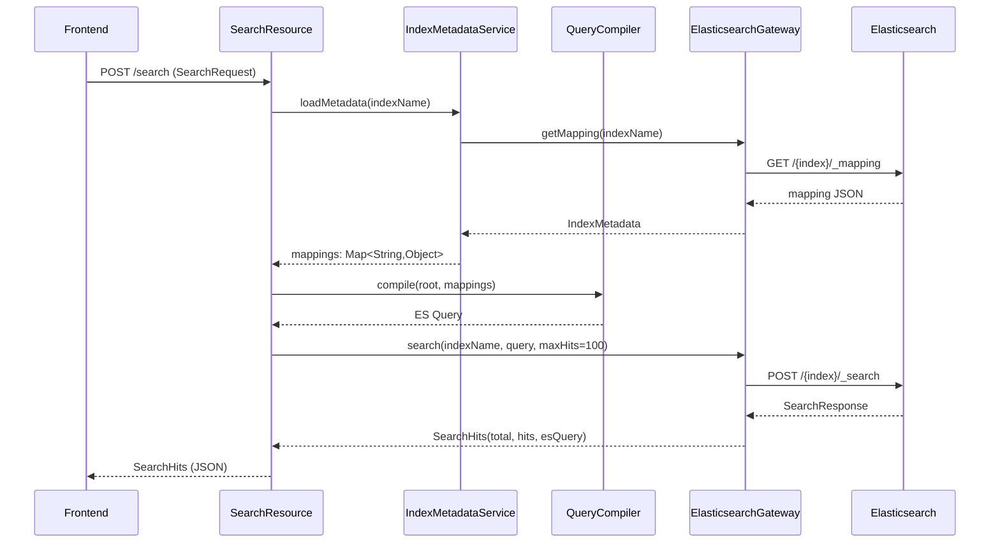
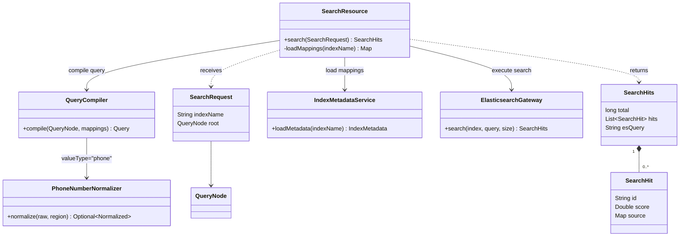
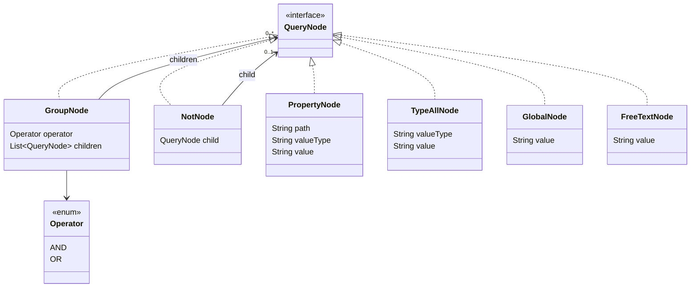
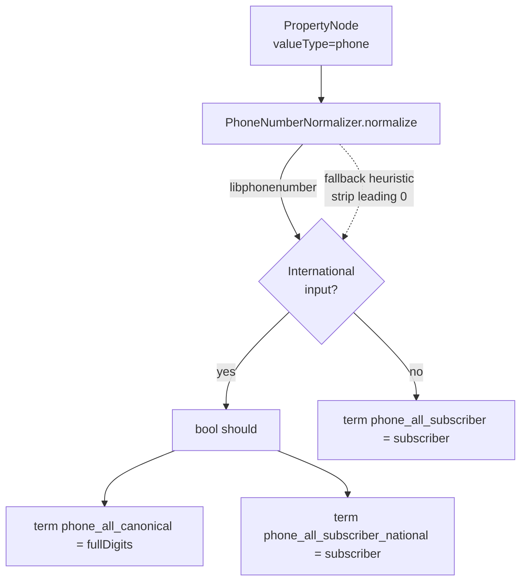

# Search Flow Overview

## Request / Response Flow

## Component Relations

## QueryNode Tree

## Phone-aware Property Compile

A `PropertyNode` with `valueType="phone"` takes a different path than the
typed branches. The `path` field is ignored; the query always targets the three
top-level catchall fields populated at index time by `PhoneCatchallCollector`
and `PhoneNumberNormalizer`:

| Field | Indexed value |
| --- | --- |
| `phone_all_canonical` | E.164 digits (CC + national significant number) for every phone in the doc. |
| `phone_all_subscriber` | National significant number alone (no CC, no trunk) for every phone. |
| `phone_all_subscriber_national` | Same as `_subscriber`, but only contributed by phones that were written in **national** form. |

`QueryCompiler.compilePhone` picks the matching shape based on whether the
input parses as international (`+` / `00` prefix) or national:

The asymmetry of `phone_all_subscriber_national` — only national-format docs
contribute — is what keeps two international-format docs in different countries
from matching each other when they happen to share a subscriber. The
international compile branch never queries `phone_all_subscriber`, so an
intl-X query cannot reach an intl-Y doc.

National-form queries depend on libphonenumber knowing the trunk-prefix rules
of the caller's country (Russia's `8`, Hungary's `06`, etc.). The default
region for query parsing is read from
`elastic-lab.phone.default-search-region`; when unset, queries fall back to a
digit-only heuristic that strips a single leading `0`.
